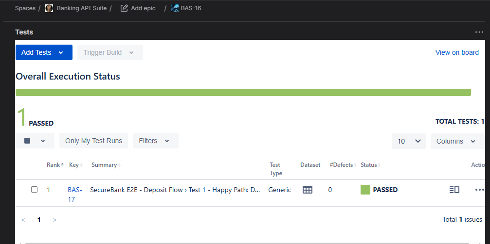

# QA Automation Portfolio

[](https://github.com/Passtelle/PLAYWRIGHT-bootcamp/actions/workflows/playwright.yml)
[](https://www.linkedin.com/in/ingridbordin)


> 13+ years at IBM Security and Fiserv. Enterprise QA instinct, rebuilt with a modern AI-first automation stack.

---

## 👋 About the Author

I spent 13+ years testing complex applications at **IBM Internet Security Systems** and **Fiserv**: antivirus engines, IDS/IPS systems, firewalls, and financial web platforms. I led offshore QA teams, built test departments from scratch, and performed penetration testing on financial applications using Metasploit.

After a career break, I returned with one goal: become the kind of QA engineer that modern FinTech teams actually need. I spent several months building this portfolio, 8 to 10 hours a day, using an AI-first workflow I believe represents where the industry is heading.

During my break I also designed and prototyped **DigitPilot**, an AI-powered crypto trading education and simulation platform ([digitpilot.io](https://digitpilot.io)), conceived in Figma and brought to life with Claude, Gemini, and Vercel. It reflects 3 years of active crypto trading experience and a deep interest in FinTech and blockchain QA.

**What I bring:**
- 🏦 Enterprise security and financial QA instinct (IBM + Fiserv)
- 🤖 Modern automation stack: Playwright, TypeScript, CI/CD, Jira/Xray
- 🧠 AI-first testing approach: directing AI tools, auditing AI-generated code, Judge LLM strategies
- 🔐 Domain knowledge: FinTech, cybersecurity, crypto/blockchain
- 🌍 Bilingual: English and French

**Looking for:** Senior QA Engineer at a FinTech or blockchain startup.

[](https://www.linkedin.com/in/ingridbordin)

---

## 🏅 Certifications

| Certification | Issuer | Date | Verify |
|--------------|--------|------|--------|
| [Claude Code in Action](https://verify.skilljar.com/c/xyjoczkwcek9) | Anthropic | Mar 2026 | [xyjoczkwcek9](https://verify.skilljar.com/c/xyjoczkwcek9) |
| [Model Context Protocol: Advanced Topics](https://verify.skilljar.com/c/wt8xrbgsvq5r) | Anthropic | Mar 2026 | [wt8xrbgsvq5r](https://verify.skilljar.com/c/wt8xrbgsvq5r) |
| [Introduction to Model Context Protocol](https://verify.skilljar.com/c/ecbtch6qi652) | Anthropic | Mar 2026 | [ecbtch6qi652](https://verify.skilljar.com/c/ecbtch6qi652) |
| [Introduction to Agent Skills](https://verify.skilljar.com/c/db8ee6b87iwy) | Anthropic | Mar 2026 | [db8ee6b87iwy](https://verify.skilljar.com/c/db8ee6b87iwy) |
| [AI Fluency Framework and Foundations](https://verify.skilljar.com/c/d5kowr6ry8cr) | Anthropic | Mar 2026 | [d5kowr6ry8cr](https://verify.skilljar.com/c/d5kowr6ry8cr) |
| [Claude 101](https://verify.skilljar.com/c/a25jqscpi26v) | Anthropic | Mar 2026 | [a25jqscpi26v](https://verify.skilljar.com/c/a25jqscpi26v) |
| ISTQB Foundation Level | ISTQB | *(in progress)* | |

---

## 🗺️ The Journey

8 to 10 hours a day since **February 2026**. Every phase built on the last. Every concept tested, audited, and committed to the repo.

| Phase | What Was Built | Status |
|-------|---------------|--------|
| **Foundation** | Playwright + TypeScript setup, async/await mental model, first loop-driven data tests | ✅ Complete |
| **POM Architecture** | Page Object Model from scratch, fixtures, hooks, multi-site coverage | ✅ Complete |
| **AI-Augmented Workflow** | Three-role audit system (Claude Code + Gemini + Human), prompt engineering, Faker.js data factory | ✅ Complete |
| **Enterprise Banking Suite** | Parabank: login, registration, account management, 3-test registration suite (happy/negative/edge) | ✅ Complete |
| **API Testing** | Postman manual lab → Playwright TypeScript automation, 4-layer coverage (happy/negative/boundary/security) | ✅ Complete |
| **E2E + CI/CD** | SecureBank full banking flow, GitHub Actions pipeline, Xray integration, auto-created Jira test executions | ✅ Complete |
| **Interview Machine** | Resume, mock interviews, ISTQB prep, GitHub Copilot | 🔄 In progress |

---

## 📁 Repository Structure

```
PLAYWRIGHT-bootcamp/
├── pages/                     # 17 Page Object Models
│   ├── SecureBankLoginPage.ts
│   ├── SecureBankDashboardPage.ts
│   ├── SecureBankTransactionPage.ts
│   └── ...                    # e-commerce, booking, Parabank POMs
│
├── tests/bootcamp/            # Full test suite (Day 1 to present)
│   ├── day32_securebank_e2e.spec.ts   # Portfolio centerpiece
│   └── ...
│
├── tests/api/                 # API test suite (DummyJSON)
│   ├── BAS-4-auth-happy-path.spec.ts
│   ├── BAS-6-auth-sql-injection.spec.ts
│   └── ...
│
├── helpers/
│   └── testData.ts            # Faker.js data factory, no hardcoded values
│
├── .github/workflows/
│   └── playwright.yml         # CI/CD pipeline (push → test → Xray → Jira)
│
├── CLAUDE.md                  # Coding standards enforced on every file
├── MASTER_PLAN.md             # Full bootcamp roadmap
├── QA_AUDIT_LESSONS.md        # 15 real lessons from AI code auditing
└── INTERVIEW_PRACTICE.md      # Mock interview sessions and answers
```

---

## 🎯 What This Project Demonstrates

| Skill | How It's Demonstrated |
|-------|----------------------|
| **E2E Test Automation** | SecureBank banking flow: login, deposit, balance verified in CI |
| **API Testing** | DummyJSON: 4 layers (happy / negative / boundary / security) in Postman + Playwright TypeScript |
| **CI/CD Pipeline** | GitHub Actions: push, test, JUnit XML, Xray upload, Jira updated automatically |
| **Page Object Model** | 17 POMs across banking, e-commerce, booking, and API test apps |
| **AI-Augmented QA** | Claude Code + Gemini Judge + GitHub Copilot multi-agent orchestration |
| **Test Management** | Jira/Xray: Gherkin BDD test cases linked to live CI executions |
| **Security Testing Mindset** | SQL injection, boundary analysis, auth token validation in API suite |

---

## 🏦 Portfolio Centerpiece: SecureBank E2E Suite

Full end-to-end banking flow running automatically on every push:

```
Push to GitHub
     ↓
GitHub Actions triggers
     ↓
Playwright runs SecureBank E2E (login → deposit → balance verified)
     ↓
JUnit XML generated
     ↓
Xray API upload → Test Execution auto-created in Jira BAS project
```

**3 Page Object Models built for this suite:**

```
pages/
├── SecureBankLoginPage.ts       → All Gold locators (data-testid)
├── SecureBankDashboardPage.ts   → Reads live balance and account stats
└── SecureBankTransactionPage.ts → Handles Radix UI comboboxes (click + getByRole)
```

Key technical decisions:
- Radix UI custom dropdowns require `.click()` then `getByRole('option')`, not `selectOption()`
- Dynamic account IDs fixed with `selectOption({ label: /Primary Savings/ })`, RegExp partial match stable after every deposit
- Client-side SPA navigation used for balance check, preserves React state vs hard reload

---

## 🧪 Test Suites

### UI Testing: SecureBank Banking App

| Test | Type | Status |
|------|------|--------|
| Login + deposit updates total balance | E2E Happy Path | ✅ Passing in CI |

**Site:** [qaplayground.com/bank](https://www.qaplayground.com/bank), a Next.js banking simulation with real `data-testid` attributes throughout.

### API Testing: DummyJSON

| Test File | Layer | What It Covers |
|-----------|-------|----------------|
| `BAS-4-auth-happy-path.spec.ts` | Happy Path | POST /auth/login → 200 + accessToken |
| `BAS-9-auth-missing-password.spec.ts` | Negative | Empty password → 400 |
| `BAS-10-auth-boundary-username.spec.ts` | Boundary | 128-char username via `'a'.repeat(128)` |
| `BAS-6-auth-sql-injection.spec.ts` | Security | SQL injection → no auth bypass, no 500 error |

All 4 layers covered: Happy Path, Negative, Boundary, Security. Designed to mirror the enterprise API coverage approach used at IBM and Fiserv.

---

## ⚙️ CI/CD Pipeline

Every push to `main` triggers the full pipeline:

```yaml
on: push (main)
  → npm ci
  → npx playwright install --with-deps
  → Run SecureBank E2E (Chromium)
  → Generate JUnit XML report
  → Upload results to Xray Cloud API
  → Test Execution auto-created in Jira BAS project
```

Credentials managed via GitHub Secrets. Never exposed in source code.



---

## 🛠️ Tech Stack

| Category | Tools |
|----------|-------|
| **Test Automation** | Playwright 1.58.1, TypeScript (strict mode) |
| **API Testing** | Postman, DummyJSON, Playwright `request` fixture |
| **Test Data** | Faker.js, dynamic data, never hardcoded |
| **CI/CD** | GitHub Actions |
| **Test Management** | Jira, Xray (BDD/Gherkin + JUnit XML import) |
| **AI Tools** | Claude Code, GitHub Copilot, Gemini (Judge LLM) |
| **Security** | dotenv, credentials always in secrets vault |

---

## 📐 Coding Standards

All code follows strict standards documented in [`CLAUDE.md`](./CLAUDE.md):

- **No `any` type**, explicit TypeScript types everywhere
- **No hardcoded timeouts**, state-based waits only (`waitFor`, `toBeVisible`)
- **No assertions in POMs**, POMs act, tests assert
- **Locator priority**: Gold (`data-testid`) > Silver (`getByRole`) > Bronze (`getByPlaceholder`)
- **RegExp with `/i` flag** for all text assertions, never exact string matching
- **Explicit method parameters**, no optional defaults hiding test intent
- **3-section test structure**: `// THE PLAN / THE WORK / THE CHECK`

Every AI-generated file passes a three-role audit before merge:
1. **Claude Code** implements following CLAUDE.md standards
2. **Gemini** independent auditor, flags violations
3. **Human Architect** final approval

15 real audit lessons documented in [`QA_AUDIT_LESSONS.md`](./QA_AUDIT_LESSONS.md).

---

*Built with Playwright, TypeScript, Claude Code, and a lot of coffee. ☕ Every commit is real work.*
